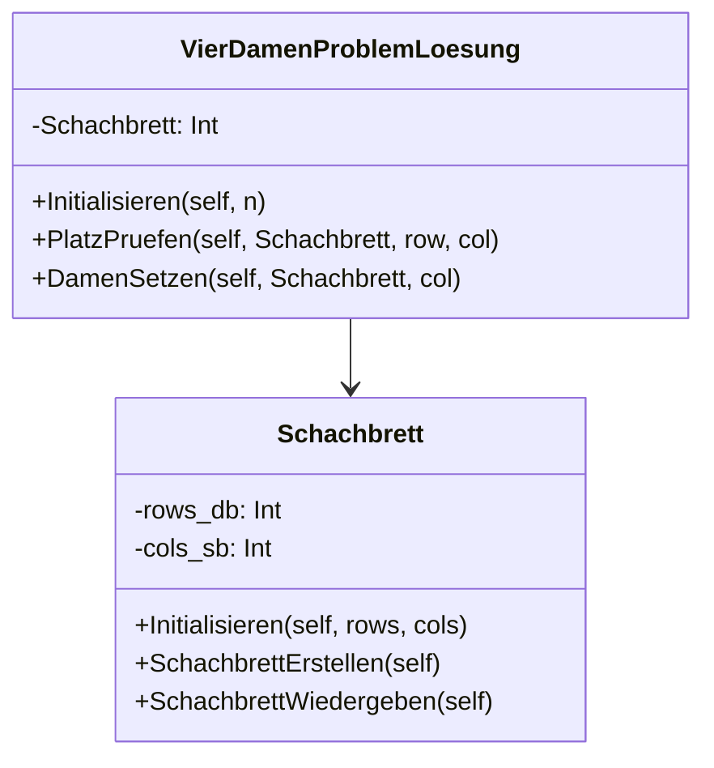

# Tim_Cordua_46808_4-Queens-Problem-4x4--field
Praktisches Projekt zur Vorlesung "Einführung Artificial Intelligence" im Wintersemester 2024 an der LFH. Das Projekt beschäftigt sich mit der Lösung des Vier-Damen-Problems auf einem 4 mal 4 Schachbrett mithilfe eines CSPs.

# Vier-Damen-Problem

## Fragen:

**Wie wird das CSP modelliert?**
Im Normalfall wird ein CSP (Constraint-Satisfaction-Problem) mithilfe von Variablen, Domänen und Constraints modelliert. Im falle des Codes zur Lösung des Vier-Damen-Problems auf einem 4x4 Schachbrett geschieht dies ebenfalls. Die Variablen entsprechen dabei im vorliegendem Code den Spalten auf dem Schachbrett. Dabei muss in jeder Spalte genau eine Zeile mit einer Dame gefüllt werden. Um diese Variablen zu lösen müssen also in einer Spalte 3 leere Felder (0) und ein Feld auf dem eine Dame (1) steht vorhanden sein. Die Domäne oder auch der Wertebereich der Variablen sind dabei die Zeilen in den Spalten, auf denen eine Dame platziert werden kann. Grundsätzlich gibt es im folgendem CSP ein generelles Constraint, das sich wiederum in 3 Einschränkungen aufteilen lässt. Generell gesagt darf keine gesetzte Dame eine Dame in einer anderen Spalte bedrohen. Daraus lässt sich aus dem Bewegungsradius der Dame schließen, dass keine zwei aus unterschiedlichen Spalten in der selben Zeile stehen dürfen. Genau so wenig dürfen 2 Damen in der selben Spalte stehen, auch wenn sie in unterschiedlichen Zeilen stehen und zuletzt dürfen keine zwei Damen auf der selben Diagonalen stehen, auch wenn diese in verschiedenen Spalten und Zeilen platziert sind.

**Wie wird ein State modelliert?**
Im vorliegendem Code wird ein State über die Klasse Schachbrett und das zweidimensionale Array self.felder, das in der Klasse Schachbrett gespeichert ist, modelliert. Die Inhalte des States sind dabei zum einen die Spalte j und die Zeile i und zum anderen ob sich auf einem Feld eine Dame befindet. Dabei wird der Wert 1 im Feld gespeichert wenn auf ihm eine Dame platziert ist und der Wert 0 wird gespeichert wenn es sich um ein leeres Feld handelt.

**Was gibt das Programm im Erfolgs/Fehlerfall aus?**
Wenn das Vier-Damen-Problem durch das CSP gelöst wurde dann gibt der Code ein Schachbrett mit 4 Spalten und 4 Zeilen, auf dem die Lösung zu sehen ist, in der Konsole aus. Dabei wird die Position der Damen auf dem Schachbrett durch eine 1 symbolisiert und die leeren Felder durch ein 0. Sollte der Code allerdings keine Lösung finden, dann gibt dieser eine einfache Nachricht in der Konsole aus. Diese besagt: "Keine Lösung gefunden!".

**Welche Heuristischen Funktionen wurden verwendet?**
In dem vorhandenen Code werden keinerlei heuristische Funktionen verwendet, da diese in diesem Fall nicht notwendig sind. Die korrekte Platzierung der einzelnen Damen kann einfach berechnet werden und erfordert daher keine Verwendung von heuristischen Funktionen. Allerdings werden zwei Strategien verwendet um das Vier-Damen-Problem zu lösen. Zum einen prüft der Algorithmus bevor eine Dame auf einem Feld platziert wird ob eine Dame auf diesem einen Feld unter Berücksichtigung der Constraints überhaupt platziert werden kann. Dies geschieht in der "PlatzPruefen" Methode der Klasse
"VierDamenProblemLoesung". Zum anderen erfolgt die Platzierung der Damen in den einzelnen Spalten von links nach rechts, der Algorithmus beginnt also in der Spalte ganz links und platziert die letzte Dame in der Spalte ganz rechts. Sollte dabei die Platzierung einer Dame scheitern, so wandert der Algorithmus in den Spalten zurück und probiert andere Platzierungen der vorherigen Damen aus, bis die Platzierung der Dame in der gescheiterten Spalte in eine der Zeilen erfolgreich ist.

## Klassendiagramm:

## Verwendete Quellen:
David Kopec (2020): Algorithmen in Python - 32 Klassiker vom Damenproblem bis zu neuronalen Netzen
